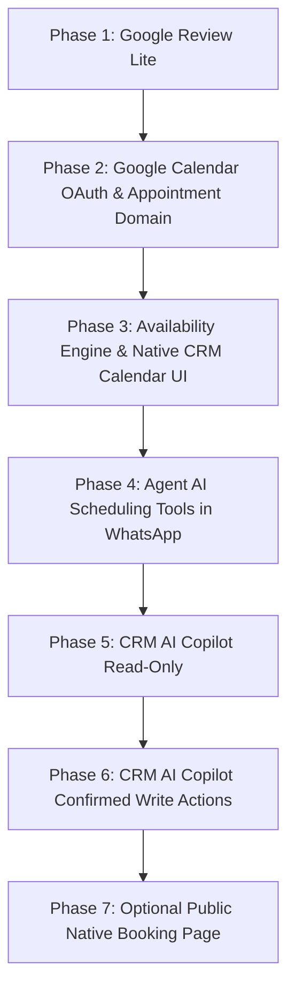

# CRM Expansion Roadmap: Calendar, Reviews & AI Copilot

This specification records the locked product decisions and phased architecture for the next major evolution of Deskcomm CRM.

---

## Status

- **Status:** **LOCKED FOR IMPLEMENTATION PLANNING**
- **Canonical Architecture:** Native Deskcomm scheduling powered by Google Calendar, Google Review Lite via WhatsApp, and an internal CRM AI Copilot.

---

## Locked Decisions

| Area | Status | Architecture & Boundaries |
| :--- | :---: | :--- |
| **Google Review Lite** | **LOCKED** | Lightweight review requests via connected WhatsApp; triggers on lead won, appointment completed, or manual send; cooldown protection; NO Google Business Profile API in V1. |
| **CRM AI Copilot** | **LOCKED** | Internal assistant for CRM operators/users (distinct from customer-facing agent); reuses AI gateway, model catalog, and MCP read tools; write actions require explicit operator confirmation. |
| **Google Calendar + Native Booking** | **LOCKED** | Google Calendar is the external calendar/busy-free engine; Deskcomm owns scheduling UI, availability rules, appointment CRM records, and agent tools; NO Cal.com dependency. |

---

## 1. Google Review Lite

- **Objective:** Allow organizations to collect Google reviews through automated and manual WhatsApp messages.
- **Configuration (stored in `organizations.settings.google_review`):**
  - `review_url`: Direct Google review link (e.g., `https://g.page/r/.../review`).
  - `template`: Configurable message with `{{google_review_url}}` and `{{nome}}` variables.
  - `cooldown_days`: Minimum days before a contact can receive another request (default 90).
  - `triggers`: Auto-send on opportunity won (`crm_leads` won) or appointment completed.
- **Execution & Safeguards:**
  - Uses existing WhatsApp outbound pipeline (`send_ledger`, `before-send` guardrails, anti-spam spacing, opt-out verification).
  - Recorded in `crm_lead_activities` and `api_audit_log` (`action: "review.requested"`).
  - Deduplication: checks `last_review_requested_at` to prevent spamming leads.

---

## 2. CRM AI Copilot

- **Objective:** Native AI assistant for CRM operators to query pipeline status, summarize contacts/conversations, and draft replies.
- **Architecture & Persona:**
  - Operates as a distinct AI point (`crm_copilot` in `lib/ai/pontos/registro.ts`), with its own model binding and prompt.
  - Bound to the current organization context via `buildAgentSystemContext` and tenant-scoped session tokens.
- **Interaction Model:**
  - **READ:** Queries contacts, conversations, leads, stages, appointments, and tasks directly using existing MCP tools (`crm_list_leads`, `crm_get_contact`, `crm_get_conversation_history`, etc.).
  - **WRITE:** Generates action proposals (e.g. "Mover oportunidade para Negociação", "Criar tarefa") rendered as actionable cards requiring explicit operator confirmation before execution.

---

## 3. Google Calendar + Native Booking

- **Objective:** Comprehensive scheduling without external SaaS calendar dependencies like Cal.com or Calendly.
- **Division of Responsibilities:**
  - **Google Calendar (Source of External Busy Blocks & Events):** Owns external schedule, event storage on Google servers, and `freebusy.query` endpoint.
  - **Deskcomm (Source of CRM Truth & Business Rules):** Owns working hours (`attendant_availability.schedule`), service duration, buffers, minimum notices, booking UI, lead linkage (`crm_lead_links`), and appointment lifecycle (`confirmed`, `completed`, `cancelled`, `no_show`).
- **Runtime Agent Tools:**
  - Customer-facing AI queries live availability (`calendar_check_availability`) and books slots (`calendar_create_appointment`) directly within WhatsApp conversations.

---

## Explicitly Out of Scope

1. **Cal.com / Calendly Integration:** Not in critical path; kept only as a conceptual adapter possibility.
2. **Omnichannel Expansion:** Deskcomm maintains focus on WhatsApp stability.
3. **Landing Page Builder:** Webhook ingestion and native booking links suffice.
4. **Google Business Profile API:** Review Lite V1 does not read reviews, reply, or calculate ratings.
5. **Public Booking Page V1:** Engine is architected to support `/book/[slug]` later, but page UI is deferred to post-MVP.

---

## Phased Implementation Order

1. **Phase 1 — Google Review Lite:** Smallest blast radius, zero migrations, immediate customer value.
2. **Phase 2 — Google Calendar Connection & Appointment Domain:** OAuth, encrypted refresh tokens, and core schema (`calendar_connections`, `calendar_event_types`, `calendar_appointments`).
3. **Phase 3 — Availability Engine & Native Calendar UI:** Working hours + Google FreeBusy slot calculator + `/app/agenda` view.
4. **Phase 4 — AI Agent Scheduling Tools:** Inbound WhatsApp booking via MCP tools (`calendar_check_availability`, `calendar_create_appointment`).
5. **Phase 5 — CRM AI Copilot (Read-Only):** Operator drawer in Inbox/Kanban querying CRM context and drafting responses.
6. **Phase 6 — CRM AI Copilot (Confirmed Write Actions):** Human-in-the-loop task creation and lead stage updates.
7. **Phase 7 — Optional Public Booking Page:** `/book/[slug]` reusing Phase 3 availability engine.

---

## Open Questions for Product Review

1. **Google OAuth Scopes in Phase 2:** Should we request `calendar.events` together with `calendar.readonly` at initial connection to prevent requiring a second user authorization when native booking launches? *(Recommended: Yes).*
2. **Google OAuth Deployment:** BYO per customer deployment (`.env`) vs Shared Central Autocora OAuth App. *(Recommended: BYO credentials via `.env` for sovereign self-hosted VPS).*
3. **Review Request Channel Fallback:** If WhatsApp 24h conversation window is closed, should Review Lite require an approved Meta template or rely on freeform WAHA? *(Recommended: Freeform on WAHA; approved utility/marketing template on Meta Cloud API).*