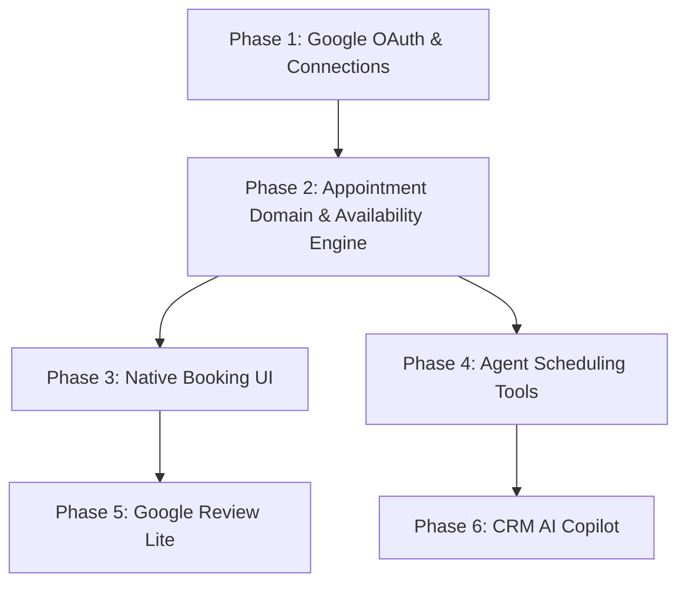

# Deskcomm CRM Roadmap — Implementation Plan

This roadmap translates the locked product decisions in [PRODUCT_DECISIONS.md](../../PRODUCT_DECISIONS.md) into concrete, modular implementation phases for engineering execution.

---

## Phased Implementation Sequence

---

### Phase 1: Google Calendar OAuth & Connection Management

- **Objective:** Enable organizations and attendants to securely connect Google Calendar via OAuth 2.0 with minimal required scopes.
- **Complexity:** **LOW / MEDIUM**
- **Scopes (Least Privilege):** `calendar.events`, `calendar.readonly`.
- **Database / Schema:**
  - Table `calendar_connections` (or `tenant_integrations` provider `'google_calendar'`) with `organization_id`, `user_id`, `access_token_encrypted`, `refresh_token_encrypted`, `scopes`, `expires_at`, `status`.
  - Tokens encrypted via `fn_encrypt_oauth` (AES-GCM); accessible only by `service_role`.
- **Backend Modules:**
  - `lib/agenda/google/oauth.ts`: Offline consent URL generation (`prompt=consent`, `access_type=offline`) and token fusion (`fundirTokens`).
  - `lib/agenda/google/estado.ts`: HMAC-SHA256 signed CSRF state with 10-minute TTL.
  - `app/api/v1/integrations/google/connect/route.ts` & `callback/route.ts`.
- **UI Surfaces:**
  - Connection management card in `/app/settings/tenant` or `/app/integrations`.
- **Tests:**
  - `tests/unit/agenda-google-oauth.test.ts` (token fusion, expiration conversion).
  - `tests/unit/agenda-google-estado.test.ts` (state validation and tampering detection).

---

### Phase 2: Native Appointment Domain & Availability Engine

- **Objective:** Establish the core appointment entities, business hours, and live slot calculation without external scheduling dependencies.
- **Complexity:** **MEDIUM**
- **Database / Schema:**
  - Migration creating `calendar_event_types` (appointment molds, duration, buffers, minimum notice, reminders) and `calendar_appointments` (booked appointments, Google event link, contact link, status).
  - Reuses `attendant_availability.schedule` for weekly working hours.
- **Backend Modules:**
  - `lib/agenda/google/tempo.ts`: Timezone, DST, and ISO 8601 formatting.
  - `lib/agenda/google/evento.ts`: Pure translation between Deskcomm appointment and Google Calendar event.
  - `lib/scheduling/availability-engine.ts`: Live slot generation (business hours minus Google `FreeBusy` blocks and buffers).
- **API Endpoints:**
  - `GET /api/v1/calendar/event-types`
  - `GET /api/v1/calendar/availability` (live slot query)
  - `POST /api/v1/calendar/appointments`
  - `PATCH /api/v1/calendar/appointments/[id]`
- **Tests:**
  - `tests/unit/agenda-google-evento.test.ts`
  - `tests/unit/availability-engine.test.ts` (buffers, business hours, notice boundaries).

---

### Phase 3: Native CRM Booking UI

- **Objective:** Provide operators with native scheduling capabilities across conversation and opportunity workflows.
- **Complexity:** **MEDIUM**
- **UI Components:**
  - `components/inbox/CRMSidePanel.tsx`: "Agendar" action and upcoming appointments card.
  - `components/kanban/LeadDossier.tsx`: Appointment card and scheduling trigger.
  - `app/app/contacts/[id]/_client.tsx`: Appointment history timeline tab.
  - `app/app/agenda/page.tsx`: Daily and weekly team agenda overview.
- **RBAC & Security:**
  - Attendants can view/create appointments for their assigned leads.
  - Managers/Admins can configure event types and reassign appointment owners.
- **Tests:**
  - Component unit tests and Playwright interaction tests for scheduling modal.

---

### Phase 4: Agent Scheduling Tools (MCP Integration)

- **Objective:** Allow customer-facing AI agents to check availability, propose slots, and confirm appointments during WhatsApp conversations.
- **Complexity:** **LOW / MEDIUM**
- **MCP Tools (`lib/mcp/tools/appointments.ts`):**
  - `crm_check_availability`: Read available slots for a given date/service.
  - `crm_create_appointment`: Create appointment in CRM and Google Calendar.
  - `crm_reschedule_appointment`: Reschedule existing appointment.
  - `crm_cancel_appointment`: Cancel appointment with recorded reason.
  - `crm_list_appointments`: Query upcoming/past appointments for a contact.
- **Safety & Runtime:**
  - Integrated via `buildMcpTurnTools`; inherits tenant isolation and `api_audit_log`.
  - Idempotency keys prevent duplicate bookings on retry.
- **Tests:**
  - `tests/unit/appointment-tools.test.ts`.

---

### Phase 5: Google Review Lite

- **Objective:** Automatically or manually trigger Google review requests to customers via WhatsApp without Google Business Profile API.
- **Complexity:** **LOW**
- **Configuration (`organizations.settings.google_review`):**
  - `enabled`, `review_url`, `message_template`, `cooldown_days`, `trigger_on_lead_won`, `trigger_on_appointment_completed`.
- **Backend & Scheduling:**
  - Trigger hook on `lead_won` (`app/api/v1/leads/[id]/win/route.ts`) and appointment `completed`.
  - Cooldown validation: ensures no duplicate request within configured window (e.g. 90 days).
  - Outbound messaging via `send_ledger` respecting opt-out and anti-ban guardrails.
- **UI Surfaces:**
  - Settings panel in `/app/settings/tenant`.
  - Manual "Pedir Avaliação" button in `components/inbox/CRMSidePanel.tsx`.
- **Tests:**
  - `tests/unit/google-review-lite.test.ts` (cooldown enforcement, template interpolation).

---

### Phase 6: CRM AI Copilot

- **Objective:** Built-in internal assistant for CRM operators to summarize interactions, detect missing data, and draft suggested replies.
- **Complexity:** **MEDIUM**
- **AI Runtime & Purpose:**
  - Registers purpose `crm_copilot` in `lib/ai/pontos/registro.ts`.
  - Reuses `buildAgentSystemContext` (`lib/ai/context/business-context.ts`) and model resolution gateway.
- **Capabilities & Handlers:**
  - `app/api/v1/ai/copilot/route.ts`: Endpoints for `summarize`, `next_action`, `draft_reply`, and `gap_analysis`.
  - Human-in-the-loop: Mutations (stage updates, appointment booking) render proposal cards requiring operator confirmation before execution.
- **UI Surfaces:**
  - Copilot drawer in `components/inbox/CRMSidePanel.tsx` and quick-insert actions in `Composer.tsx`.
- **Tests:**
  - `tests/unit/crm-copilot.test.ts` (context assembly, permission boundary checks).